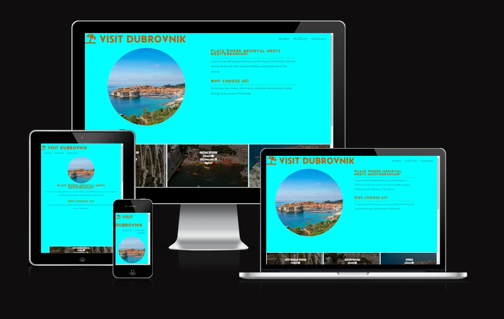

# VISIT DUBROVNIK

Visit Dubrovnik is a student-made website that helps you learn about, and hopefully visit the pearl of Adriatic - city of Dubrovnik! It is built as first milestone assignment with the Code Institute. Page targets people who love to travel and offers great range of activities available in Dubrovnik for people of all ages. Necessary information about Visit Dubrovnik is distributed through Index page (contains intro section and times section), Gallery (extensive visual representation of Dubrovnik) and Contact page (with contact form and detailed contact info).

## Features

### Header

- Featured at the top of the page, the header shows logo in the left corner
- Logo is styled with Font Awesome icon (fa-solid fa-umbrella-beach) and color of logo looks like a sandy beach
- When clicked, logo takes user to index.html

### Menu

- Featured in the top right corner of the page, menu is composed of three links
- Links are named Home, Gallery and Contact, and lead to three separate pages (index.html, gallery.html and contact.html)
- When used on smaller devices the menu goes under logo

### Home

- Home page is design to pique the interest of a user and to relay basic information about the site
- To make content clear, page is divided into Dub-intro section and Dub-explore section

#### Dub-intro section

- This section identifies the purpose of the page and provides brief information about
- Panoramic image of city of Dubrovnik is placed on the left side of section to captivate user visually
- On the right side of the section user is given details about the city of Dubrovnik and a reason to continue scrolling

#### Dub-explore section

- This section gives details about what Visit Dubrovnik offers to users
- Section starts with multiple options for activities (tours), meeting points, duration and age restrictions
- When tours are hovered with mouse they reveal detailed information
- Section is concluded with table (contains days and starting times for tours) and paragraph of important information for user

### Gallery

- Gallery page is filled stunning images of the city and it's surrounding
- Intent of Gallery is to visually pique users interest and improve User experience of the site
- Images in gallery are divided into three columns
- To match the viewing experience when viewed on very small screens, images are lined up into two columns

### Contact

- This page is designed to enable contact between user and host (Visit Dubrovnik)
- Contact page is divided into two sections, placed horizontally next to each other
- Left section has a form to collect details from user and send message and it is intended as a primary way of communicating
- As a alternative to form, right section contains address and telephone number
- When used on smaller devices the right section goes under the form, and both are centered

### Footer

- As a page footer I used links to social media
- Links open in new tab when clicked and are displayed on my site using Font Awesome icons
- Same footer is used for all three pages

## Testing

- I tested that this page works on different browsers: Chrome, Edge, Firefox.
  - I have confirmed that project is responsive, looks good and functions as intended on all standard screens
- I have confirmed that all three pages serve their function, are readable and easy to navigate
- I have confirmed that hover action in index.html works
- I have confirmed that form in contact.html works, entries in all fields are required, email field only accepts an email, and submit button works

### Validator Testing

- W3C HTML validator returns no errors
- W3C CSS validator returns no errors
- I used lighthouse in retools and it's suggestions to improve my page's performance

## Deployment

- Site was deployed to GitHub pages
- The live link is available here - [VISIT DUBROVNIK](https://staman1702.github.io/visit-dubrovnik/)

## Credits

- [Google Fonts:](https://fonts.google.com/) Font family "Alegreya" was used on all pages.
  - [Font Awesome:](https://fontawesome.com/) Used in header, footer, dub-explore section of index.html and contact.html headings to add icons.
  - [Am I Responsive:](http://ami.responsivedesign.is) Was used to check responsiveness of page.
  - [Pexels:](https://www.pexels.com/) Source of free images used in index.html and gallery.html.
  - [Free Convert:](https://www.freeconvert.com/) Converting PNG and JPEG images to WEBP.
